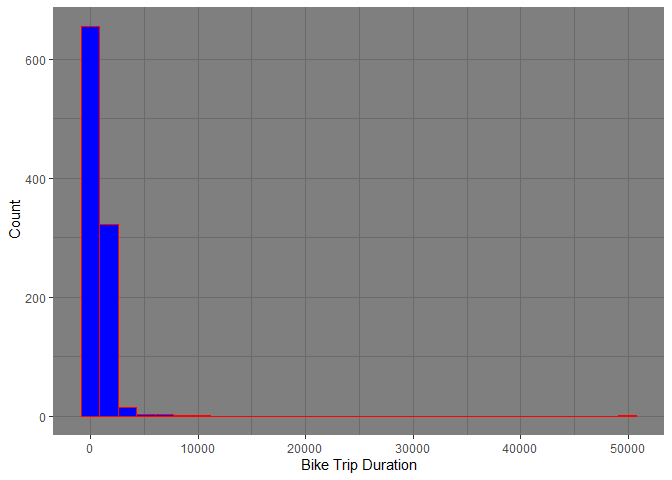
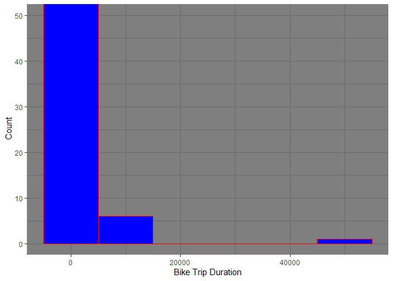
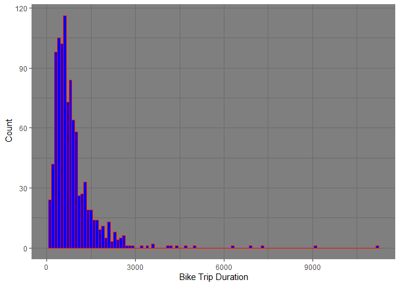
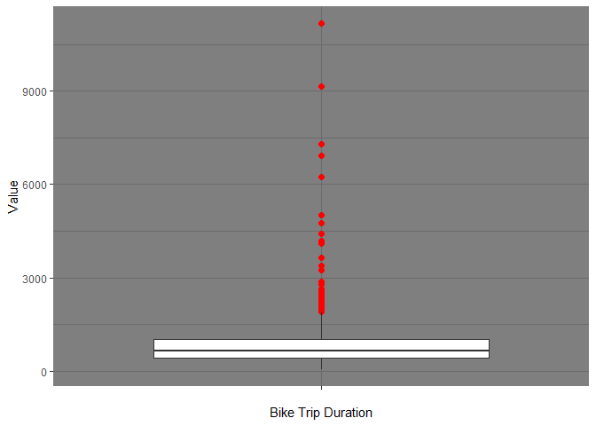
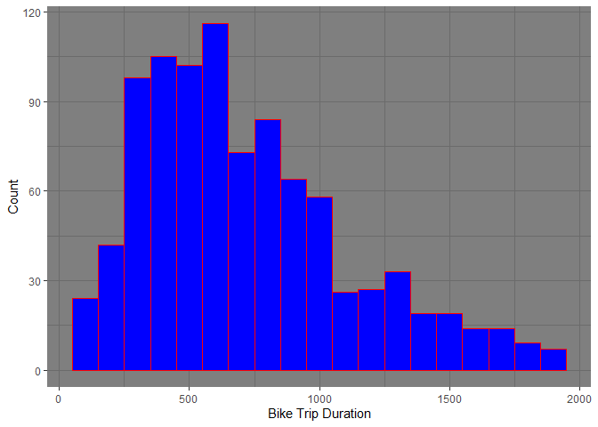
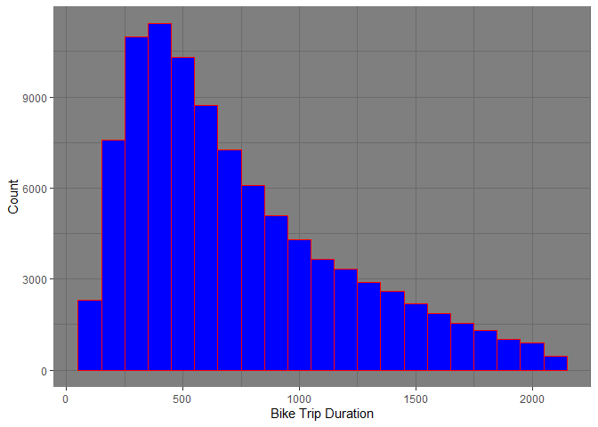
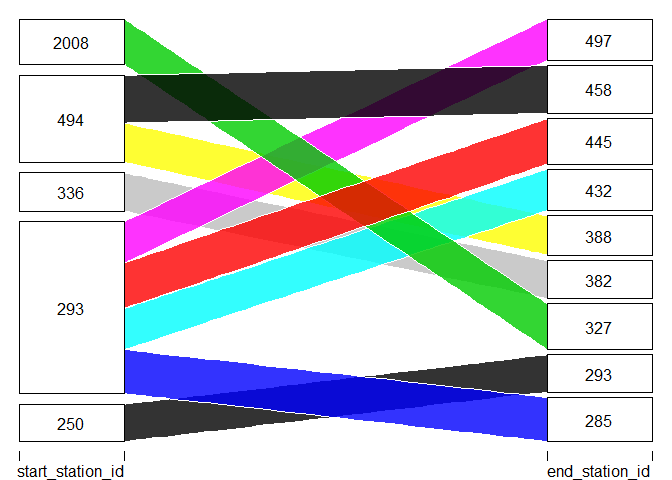
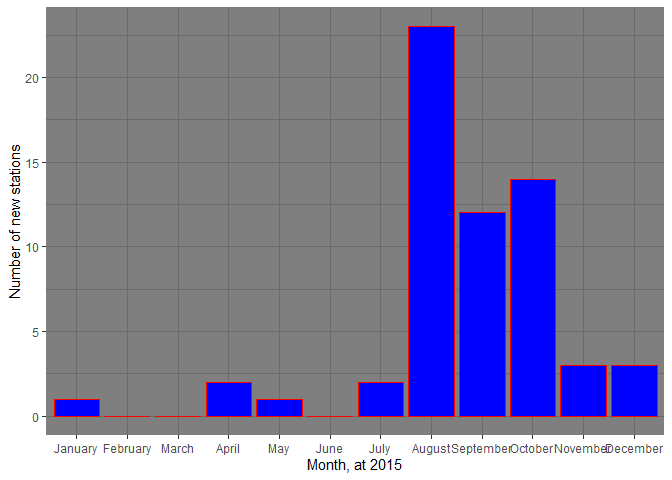

Initialization, Import Required Libraries
=========================================

    library(bigrquery)
    library(tidyverse)

    ## Warning: package 'tidyverse' was built under R version 3.6.2

    ## Warning: package 'tidyr' was built under R version 3.6.2

    ## Warning: package 'purrr' was built under R version 3.6.2

Now, the next step of the analysis would be the writing the SQL query to
retrieve the data from the Google Cloud Platform. The data set could be
found from: [LINK TO DATA
SET](https://console.cloud.google.com/marketplace/details/city-of-new-york/nyc-citi-bike "Google's Homepage")

SQL for Query
=============

Firs, in order to have the overview on the data-set, we import all the
columns and but in order to avoid the massive data-set, we limit the
rows to 1000.

    # Project IDå
    project_id <- "xenon-muse-261616" # put your project ID here

    # query
    sql_string <- "SELECT *
    FROM
      [bigquery-public-data.new_york.citibike_trips]
    LIMIT
      1000"

    # Execute the query and store the result
    NY_sample <- query_exec(sql_string, project = project_id, 
                            useLegacySql = FALSE)

    ## Using an auto-discovered, cached token.
    ## To suppress this message, modify your code or options to clearly consent to the use of a cached token.
    ## See gargle's "Non-interactive auth" vignette for more details:
    ## https://gargle.r-lib.org/articles/non-interactive-auth.html
    ## The bigrquery package is using a cached token for kor.peyman@gmail.com.

    ## 0 bytes processed

Now, have a look on the head of the data:

DATA Overview
=============

First, let’s have the first look on the head of the data to get to know
the data.

    head(NY_sample)

    ##   tripduration           starttime            stoptime start_station_id
    ## 1          134 2016-04-11 18:15:31 2016-04-11 18:17:45              520
    ## 2          130 2016-08-05 19:41:30 2016-08-05 19:43:40              520
    ## 3           69 2013-10-26 17:00:24 2013-10-26 17:01:33              520
    ## 4          644 2016-08-29 13:14:35 2016-08-29 13:25:20              520
    ## 5         1212 2016-07-20 11:55:56 2016-07-20 12:16:09              520
    ## 6          490 2015-05-22 11:31:51 2015-05-22 11:40:02              520
    ##   start_station_name start_station_latitude start_station_longitude
    ## 1    W 52 St & 5 Ave               40.75992               -73.97649
    ## 2    W 52 St & 5 Ave               40.75992               -73.97649
    ## 3    W 52 St & 5 Ave               40.75992               -73.97649
    ## 4    W 52 St & 5 Ave               40.75992               -73.97649
    ## 5    W 52 St & 5 Ave               40.75992               -73.97649
    ## 6    W 52 St & 5 Ave               40.75992               -73.97649
    ##   end_station_id end_station_name end_station_latitude end_station_longitude
    ## 1            520  W 52 St & 5 Ave             40.75992             -73.97649
    ## 2            520  W 52 St & 5 Ave             40.75992             -73.97649
    ## 3            520  W 52 St & 5 Ave             40.75992             -73.97649
    ## 4            520  W 52 St & 5 Ave             40.75992             -73.97649
    ## 5            520  W 52 St & 5 Ave             40.75992             -73.97649
    ## 6            520  W 52 St & 5 Ave             40.75992             -73.97649
    ##   bikeid   usertype birth_year  gender
    ## 1  17697 Subscriber       1988    male
    ## 2  16177 Subscriber       1989    male
    ## 3  18263 Subscriber       1957    male
    ## 4  24139   Customer         NA unknown
    ## 5  24107 Subscriber       1962    male
    ## 6  21000 Subscriber       1982    male

Another important will be to look whether the data contain any NA
values, so that we could be cautious about our analysis in the next
steps. Now, the following code will provide the NA values in each
columns:

    colSums(is.na(NY_sample))

    ##            tripduration               starttime                stoptime 
    ##                       0                       0                       0 
    ##        start_station_id      start_station_name  start_station_latitude 
    ##                       0                       0                       0 
    ## start_station_longitude          end_station_id        end_station_name 
    ##                       0                       0                       0 
    ##    end_station_latitude   end_station_longitude                  bikeid 
    ##                       0                       0                       0 
    ##                usertype              birth_year                  gender 
    ##                       0                     140                       0

Mostly GOOD!. However, we notice that the *birth\_year* column contains
NA values. Another point is the *Column Type* we want to look that the
imported data has the right format as we believe based on our
understanding of the data, let’s have look:

    sapply(NY_sample, class)

    ## $tripduration
    ## [1] "integer"
    ## 
    ## $starttime
    ## [1] "POSIXct" "POSIXt" 
    ## 
    ## $stoptime
    ## [1] "POSIXct" "POSIXt" 
    ## 
    ## $start_station_id
    ## [1] "integer"
    ## 
    ## $start_station_name
    ## [1] "character"
    ## 
    ## $start_station_latitude
    ## [1] "numeric"
    ## 
    ## $start_station_longitude
    ## [1] "numeric"
    ## 
    ## $end_station_id
    ## [1] "integer"
    ## 
    ## $end_station_name
    ## [1] "character"
    ## 
    ## $end_station_latitude
    ## [1] "numeric"
    ## 
    ## $end_station_longitude
    ## [1] "numeric"
    ## 
    ## $bikeid
    ## [1] "integer"
    ## 
    ## $usertype
    ## [1] "character"
    ## 
    ## $birth_year
    ## [1] "integer"
    ## 
    ## $gender
    ## [1] "character"

Seems the column format is appropriate and no further change is needed
at least in this stage.

Question: What is the trip duration distribution of Citibike trips?
===================================================================

So, if we want to have look on the trip distribution, first we have look
on the data-set we imported (1000) as the sample from the whole
population. In the next steps, we further increase the size of the data
to see is there any significant change from the analysis of the initial
sample size.

    ggplot(NY_sample, aes(tripduration)) +
      geom_histogram(fill = 'blue',color='red') +
      xlab("Bike Trip Duration") +
      ylab(" Count") +
      theme_dark()

Closer look on the *tripduration* we could figure out that the data has
some outlier or possible some very off value. To have better
understanding of this issue, we reduce the y axis limit to see where the
outlier are:

    ggplot(NY_sample, aes(tripduration)) +
      geom_histogram(binwidth = 10000, fill = 'blue',color='red') +
      coord_cartesian(ylim = c(0,50)) +
      xlab("Bike Trip Duration") +
      ylab(" Count") +
      theme_dark()

Seems, there are some very long bike trip, let’s have look on them;
let’s say the all bike trips more than 30000 sec:

    NY_sample %>% 
      filter(tripduration > 30000) %>% 
      arrange(tripduration)

    ##   tripduration           starttime            stoptime start_station_id
    ## 1        49987 2015-10-06 18:36:44 2015-10-07 08:29:51              520
    ##   start_station_name start_station_latitude start_station_longitude
    ## 1    W 52 St & 5 Ave               40.75992               -73.97649
    ##   end_station_id    end_station_name end_station_latitude end_station_longitude
    ## 1            475 E 16 St & Irving Pl             40.73524             -73.98759
    ##   bikeid   usertype birth_year gender
    ## 1  23929 Subscriber       1965 female

What we can say these three trips are about more than 10 hours of
biking!, seems something unusual and probably are not the correct data
due to error in registering the time or other issues, now we in this
case considering theses cases, we do not include these three rows in the
further analysis.

    NY_sample_fil <- NY_sample %>% 
      filter(tripduration < 30000)

Now, let’s plot the filtered data set and see the distribution of the
*tripduration*:

    ggplot(NY_sample_fil, aes(tripduration)) +
      geom_histogram(binwidth = 100, fill='blue', color='red') +
      xlab("Bike Trip Duration") +
      ylab(" Count") +
      theme_dark()

Ok, now we could see that the data has the outlier. To further check
this issue, we draw the BOX plot of the data to look:

    ggplot(NY_sample_fil, aes(x = "", y=tripduration)) +
      geom_boxplot(outlier.colour="red", 
                 outlier.shape=16,
                 outlier.size=2, notch=FALSE) +
      xlab("Bike Trip Duration") +
      ylab("Value") +
      theme_dark()

Now, to be more clear about the real distribution of trip time, we again
plot the distribution, yet this time we do not include the outlier in
the dataset. By definition, here the outlier means the data *outside* of
the 1.5 IQR from the 75% and 25 % quantile of the data. Have look on the
distribution without the outliers:

    quantile_query <- quantile(NY_sample_fil$tripduration,c(0.25,0.75))
    lower_range <- quantile_query[1]-1.5*IQR(NY_sample_fil$tripduration)
    upper_range <- quantile_query[2]+1.5*IQR(NY_sample_fil$tripduration)

    NY_sample_fil %>% 
      filter(tripduration > lower_range & tripduration < upper_range) %>% 
      ggplot(aes(tripduration)) +
      geom_histogram(binwidth = 100, fill='blue', color='red') +
      xlab("Bike Trip Duration") +
      ylab("Count") +
      theme_dark()

However, the above data analysis were for the small sample (10000 rows),
how about the large data-set. Here, we include the 1,000,000 rows to be
included in the analysis to provide the better understanding the
distribution.

    # Project ID
    project_id <- "xenon-muse-261616" # put your project ID here

    # query
    sql_string_tot <- "SELECT 
      tripduration
    FROM
      [bigquery-public-data.new_york.citibike_trips]
    LIMIT
    100000"
    # Execute the query and store the result
    NY_Lsample <- query_exec(sql_string_tot, project = project_id, 
                             useLegacySql = FALSE, max_pages = 100)

    ## 0 bytes processed

We again plot the data-set this time without the outlier when the larger
rows were included in the data-set.

    quantile_queryL <- quantile(NY_Lsample$tripduration,c(0.25,0.75))
    lower_rangeL <- quantile_queryL[1]-1.5*IQR(NY_Lsample$tripduration)
    upper_rangeL <- quantile_queryL[2]+1.5*IQR(NY_Lsample$tripduration)

    NY_Lsample %>% 
      filter(tripduration > lower_rangeL & tripduration < upper_rangeL) %>% 
    ggplot(aes(tripduration)) +
      geom_histogram(binwidth = 100, fill='blue', color='red') +
      xlab("Bike Trip Duration") +
      ylab("Count") +
      theme_dark()

Question: What is the most popular Citibike trip?
=================================================

So, from the previous question we got to know the data and how is look
like. For this question we only import the two rows we needed in the
question, *start\_station\_id* and *end\_station\_id*, also we get the
about 1,000,000 rows this time:

    # Project ID
    project_id <- "xenon-muse-261616" # put your project ID here

    # query
    sql_string_tot_trip <- "SELECT 
      start_station_id,
      end_station_id
    FROM
      [bigquery-public-data.new_york.citibike_trips]
    LIMIT
    100000"
    # Execute the query and store the result
    NYL_trip <- query_exec(sql_string_tot_trip, project = project_id, useLegacySql = FALSE, max_pages = 100)

    ## 0 bytes processed

have the brief look on the data:

    head(NYL_trip)

    ##   start_station_id end_station_id
    ## 1              512            520
    ## 2              512            403
    ## 3              512            403
    ## 4              512            363
    ## 5              512            363
    ## 6              512            363

Here, we group the data based on the *start\_station\_id* and as well
*end\_station\_id* and then we count the number of trip between any two
starting and end station:

    NYL_trip_group <- NYL_trip %>% 
      count(start_station_id,end_station_id) %>% 
      filter(n > 100) %>% 
      arrange(desc(n))
    NYL_trip_group

    ## # A tibble: 9 x 3
    ##   start_station_id end_station_id     n
    ##              <int>          <int> <int>
    ## 1              494            458   130
    ## 2              293            445   124
    ## 3             2008            327   124
    ## 4              293            285   120
    ## 5              293            432   112
    ## 6              293            497   112
    ## 7              494            388   107
    ## 8              336            382   104
    ## 9              250            293   102

Now, we can plot the result in one river plot which thickness of the
each river show the *count* of the trip between two two stations:

    library(alluvial)
    alluvial(NYL_trip_group[,1:2], freq=NYL_trip_group$n, xw=0.0, alpha=0.8,       
              gap.width=0.1, col= 1:9, border="white")

However, maybe the the trip between the same *station\_id* may not be
informative, therefore in the new plot we removed the same start and end
stations and includes the only trips where have different start and end
point:

    library(alluvial)
    NYL_trip_group_nonsim <- NYL_trip %>% 
      filter(start_station_id != end_station_id) %>% 
      count(start_station_id,end_station_id) %>% 
      filter(n > 100) %>% 
      arrange(desc(n)) 
      
      
    alluvial(NYL_trip_group_nonsim[,1:2], freq=NYL_trip_group_nonsim$n, xw=0.0, alpha=0.8,       
              gap.width=0.1, col= 1:9, border="white")

Question: Were there new bike stations introduced or removed at any point in time? What makes you think it were or weren’t?
===========================================================================================================================

So, to answer this question we first need to import the two columns ,
*starttime* and *start\_station\_id*. Here we assume if new station was
introduced in the start station so that the new trips could be done
using this station.

    # Project ID
    project_id <- "xenon-muse-261616" # put your project ID here

    # query
    sql_string_newsta <- "SELECT 
      starttime,
      start_station_id
    FROM
      [bigquery-public-data.new_york.citibike_trips]
    LIMIT
    100000"
    # Execute the query and store the result
    NYL_newsta <- query_exec(sql_string_newsta, project = project_id, 
                             useLegacySql = FALSE, max_pages = 100)

    ## 0 bytes processed

Now, the code below shows the distinct start station id per month. So,
this could be helpful when in the next stage when we want to know which
station was added or removed.

    NYL_newsta_group <- NYL_newsta %>%
      mutate(month = as.numeric(format(starttime, "%m")), year = as.numeric(format(starttime, "%Y")), 
             day=as.numeric(format(starttime, "%d"))) %>%
      select(year, month, start_station_id) %>% 
      distinct(year, month, start_station_id, .keep_all = TRUE) %>% 
      group_by(year, month, start_station_id) %>% 
      arrange(year, month)

For example, we could ask what station was added to the trips on month 8
of 2013. To do that, we compare the whole recorded trip until the month
7 of 2013 and compare it with the month 8 of 2013.

    old <- NYL_newsta_group %>% 
      filter(year<=2013 & month <= 10) %>% 
      pull(start_station_id)

    old <- unique(old)

    new <- NYL_newsta_group %>% 
      filter(year==2014 & month == 10) %>% 
      pull(start_station_id)

The new stations added to the biking trips on the month 8 of 2013 are
includes:

    new[!(new %in% old)]

    ## [1] 530

Now, we can see that the station number 502 was added to the traveling
route on month 8th of 2013.

Now, let’s look what station was removed during the time. Let’s say what
station were removed at October of 2014 when compared to October of the
2013.

    old <- NYL_newsta_group %>% 
      filter(year<=2013 & month <= 10) %>% 
      pull(start_station_id)

    old <- unique(old)

    new <- NYL_newsta_group %>% 
      filter(year==2014 & month == 10) %>% 
      pull(start_station_id)

    old[!(old %in% new)]

    ## [1] 427 243

The stations named 517 and 243 were available on October of 2013 but,
were not available on the October of 2014.

For the number of stations added to the route, we here calculate the
number of stations were added at 2015, per month.

    new_station <- numeric(12)
    for (mnt in 1:12) {
      if (mnt==1) {
        yr = 2014
        mnth = 12
        mnt = 1
    } else {
    yr = 2015
    mnth = mnt-1
    }

    old <- NYL_newsta_group %>% 
      filter(year<=yr & month <= mnth) %>% 
      pull(start_station_id)

    old <- unique(old)

    new <- NYL_newsta_group %>% 
      filter(year==2015 & month == (mnt)) %>% 
      pull(start_station_id)

    new_station[mnt] <- length(new[!(new %in% old)])
    }

    months <- c("January", "February", "March", "April","May","June", "July", 
                "August", "September", "October", "November", "December" )

    df_newstat <- data.frame(month=months,
                             New_Stations = new_station)

    ggplot(data=df_newstat, aes(x=factor(month,levels=month.name), y=New_Stations)) +
      geom_bar(stat="identity", fill='blue', color='red') +
      xlab("Month, at 2015") +
      ylab("Number of new stations") +
      theme_dark()

