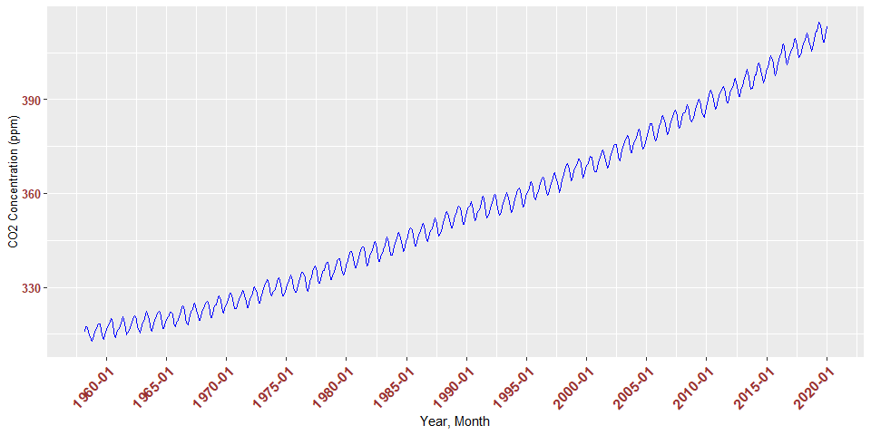
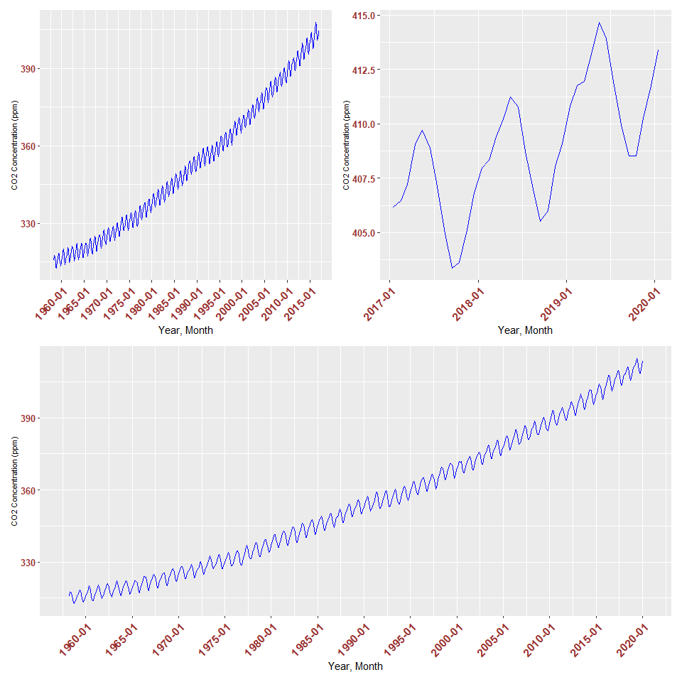
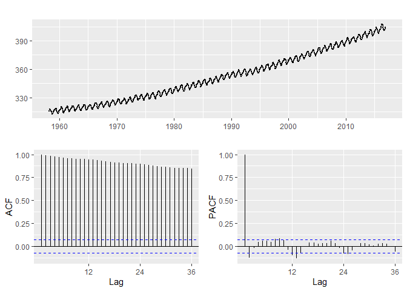
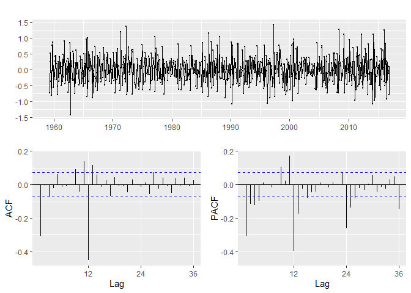
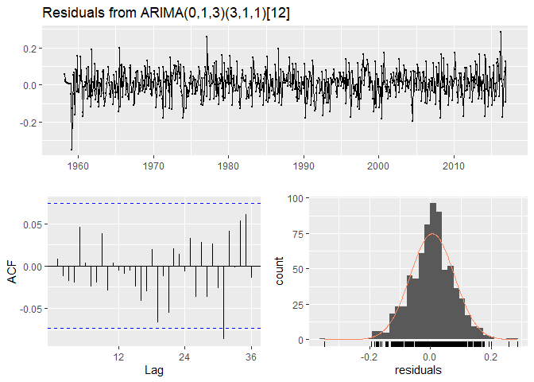
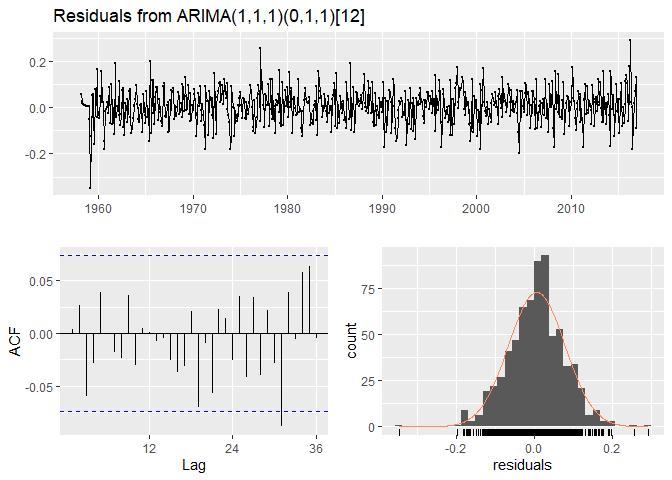
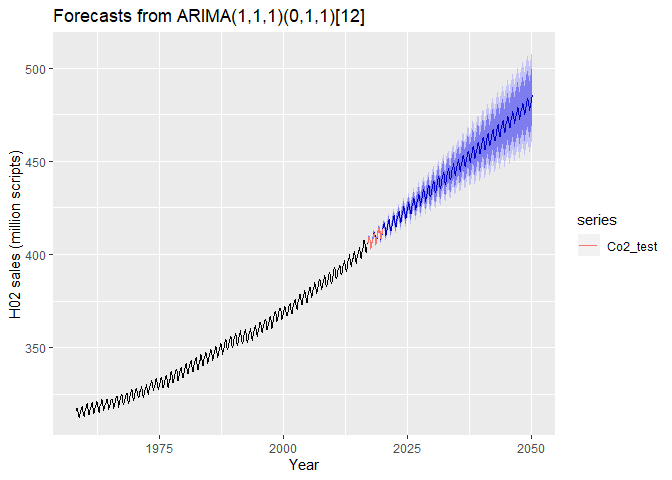
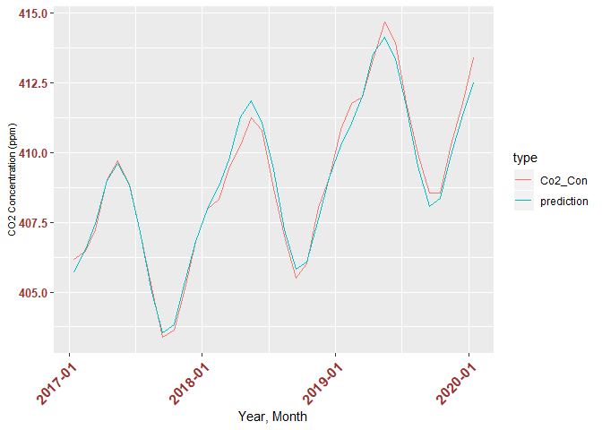
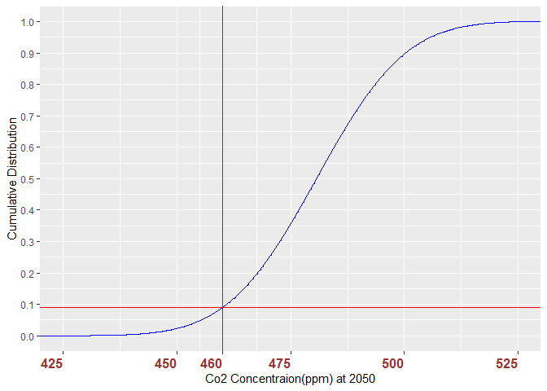

Question 3.1 Plotting
---------------------

The data set is divided to two sets. From the beginning until the
beginning of the 2018 is considered as the **Train** Data set and from
Jan 2018 beyond is considered the **Test** data-set.

    #library(tidyverse)
    #library(forecast)
    #library(lubridate)
    #library(car)
    #library(scales)
    #install.packages('patchwork')
    #library(patchwork)
    suppressMessages(library(kableExtra))

    ## Warning: package 'kableExtra' was built under R version 3.6.2

    suppressMessages(library(knitr))

    ## Warning: package 'knitr' was built under R version 3.6.2

    suppressMessages(library(DT))

    ## Warning: package 'DT' was built under R version 3.6.2

    suppressMessages(library(tidyverse))

    ## Warning: package 'tidyverse' was built under R version 3.6.2

    ## Warning: package 'tidyr' was built under R version 3.6.2

    ## Warning: package 'purrr' was built under R version 3.6.2

    suppressMessages(library(forecast))

    ## Warning: package 'forecast' was built under R version 3.6.2

    suppressMessages(library(car))

    ## Warning: package 'car' was built under R version 3.6.2

    suppressMessages(library(patchwork))

    ## Warning: package 'patchwork' was built under R version 3.6.2

    suppressMessages(library(scales))

    ## Warning: package 'scales' was built under R version 3.6.2

    suppressMessages(library(lubridate))

### Data Import:

The data will of mounthly Co2 Concentration in (Part Per Million) over
the period of the “1960/3-2019/12” measured at Mauna Loa Observatory,
Hawaii. The link for the this data available at:

\[<a href="ftp://aftp.cmdl.noaa.gov/products/trends/co2/co2_mm_mlo.txt" class="uri">ftp://aftp.cmdl.noaa.gov/products/trends/co2/co2_mm_mlo.txt</a>\]

Now, to read this data in the R, couples of points must be considered:

-   The data has the comments, which is not our interest of analysis.
    Therefore, in import code we show that with *comment.char = ‘\#’ *,
-   The data has 7 columns yet some of them like the Year and Month
    label have not been written in the data, so while importing we
    assing the folloowing column names:
-   The columns wwere seperate using the white space, therfore the sep =
    ’’ will be added to the code.
-   Year,Month,Time,Co2\_con,Interpolated,Trend,Days
-   Since we are including the column names, the header = F could be
    included.

<!-- -->

    data <- read.delim('ftp://aftp.cmdl.noaa.gov/products/trends/co2/co2_mm_mlo.txt', comment.char = '#', header = F, sep = '', col.names = c('Year','Month','Time','Co2_Concentration','Interpolated','Trend','Days'))

#### Make Data Tidy:

Look on any NA values:

    which(is.na(data))

    ## integer(0)

Good, we have the complete measured data! However when read the data we
see some -99.99 values! - be careful, as was mentioned in the comments
these values are when the measurement were not avilable - so for these
points (which are 7 out of 741 measueremnets), we use the *Interpolated*
colmns:

    data_cc <- data %>% 
        mutate(
            Co2_Con = case_when(
                Co2_Concentration == -99.99 ~ Interpolated,
                TRUE ~ Co2_Concentration
            )
        )

Let’s jhave look on column types:

    sapply(data_cc, class)

    ##              Year             Month              Time Co2_Concentration 
    ##         "integer"         "integer"         "numeric"         "numeric" 
    ##      Interpolated             Trend              Days           Co2_Con 
    ##         "numeric"         "numeric"         "integer"         "numeric"

We can see that column types are in approriate format, yet we can add
the new column named *Date* which give the date of measurement in the
standard time sery format:

### Data Transform

Here *Lubridate* package provides a easy method to convert our *Year*
and *Month* column to date:

    data_cc$Date <- ymd(paste0(data$Year, " ", data$Month, " ", "15"))

Also, we can see in the analysis we want to do, we do not the following
columsn, so we could select the requered column needed our analys:

    data_cc_sel <- data_cc %>% 
        select(Year, Month, Date, Co2_Con )

Also, we need to have portion of our data, to test the model we develop
based on the training data- So, Here, we consider the data for *2017*,
*2018* and *2019* as the test data, the rest are the training data.

    data_cc_sel_test <- data_cc_sel %>% 
        filter(Year > 2016)
    data_cc_sel_train <- data_cc_sel %>% 
        filter(Year <= 2016)

### Data Visulization

Now, let’s visulize the data first,

    ggplot(data_cc_sel,aes(Date, Co2_Con)) +
        geom_line(color='blue') +
        xlab("Year, Month") +
        scale_x_date(date_labels = "%Y-%m", date_breaks = "5 year") +
        theme(axis.text.x = element_text(face = "bold", color = "#993333", 
                               size = 12, angle = 45, hjust = 1)) +
        ylab("CO2 Concentration (ppm)") +
        #scale_x_continuous(breaks = trans_breaks(identity, identity, n = 10))
        scale_y_continuous() +
        theme(axis.text.y = element_text(face = "bold", color = "#993333", 
                               size = 10, hjust = 1),axis.title.y = element_text(size = 10))

    p1 <- ggplot(data_cc_sel,aes(Date, Co2_Con)) +
        geom_line(color='blue') +
        xlab("Year, Month") +
        scale_x_date(date_labels = "%Y-%m", date_breaks = "5 year") +
        theme(axis.text.x = element_text(face = "bold", color = "#993333", 
                               size = 12, angle = 45, hjust = 1)) +
        ylab("CO2 Concentration (ppm)") +
        #scale_x_continuous(breaks = trans_breaks(identity, identity, n = 10))
        scale_y_continuous() +
        theme(axis.text.y = element_text(face = "bold", color = "#993333", 
                               size = 10, hjust = 1),axis.title.y = element_text(size = 8))

    p2 <- ggplot(data_cc_sel_train,aes(Date, Co2_Con)) +
        geom_line(color='blue') +
        xlab("Year, Month") +
        scale_x_date(date_labels = "%Y-%m", date_breaks = "5 year") +
        theme(axis.text.x = element_text(face = "bold", color = "#993333", 
                               size = 12, angle = 45, hjust = 1)) +
        ylab("CO2 Concentration (ppm)") +
        #scale_x_continuous(breaks = trans_breaks(identity, identity, n = 10))
        scale_y_continuous() +
        theme(axis.text.y = element_text(face = "bold", color = "#993333", 
                               size = 10, hjust = 1), axis.title.y = element_text(size = 8))

    p3 <- ggplot(data_cc_sel_test,aes(Date, Co2_Con)) +
        geom_line(color='blue') +
        xlab("Year, Month") +
        scale_x_date(date_labels = "%Y-%m", date_breaks = "1 year") +
        theme(axis.text.x = element_text(face = "bold", color = "#993333", 
                               size = 12, angle = 45, hjust = 1)) +
        ylab("CO2 Concentration (ppm)") +
        #scale_x_continuous(breaks = trans_breaks(identity, identity, n = 10))
        scale_y_continuous() +
        theme(axis.text.y = element_text(face = "bold", color = "#993333", 
                               size = 10, hjust = 1), axis.title.y = element_text(size = 8))

    (p2 | p3 ) /
          p1

Modeling:
---------

In time series analysis, first things we need to know about the trends
are:

-   Is the data staionary?
-   Answer: Not, we see the clear trend in in the plot, so the co2
    concentration depends on time. (sig of non -stationary)
-   Is there any seasonality in data?
-   Answer: Yes, we can difintely see the seasonality in the data. Now,
    knowing the the non-statinary and seasonality of the data, it
    suggest to use theseasons differencing to model the data. To answer,
-   How is Autocorelation function and Partial Auto corellation?

Here is the plot of ACF and PACF from the *forecast* package:

    Co2_train <- ts(data_cc_sel_train$Co2_Con, start = c(1958,3), frequency = 12)
    Co2_train %>% ggtsdisplay()

Clearly the the data shows the differencing, now we make the ordinary
diffrencing of the with the lag of 12:

    #Co2_train %>% diff(1,lag=12) %>% ggtsdisplay()
    Co2_train %>% diff(lag=12) %>% diff() %>% ggtsdisplay()

Now, it is better, we subtanitally removed the trend and as well the ACF
is declining until the lag =12. At this stage, we can go for another
diffrencing , but it is choice and there is no clear distinction. We
start the model with the *d* = *D* = 1 in the $ARIMA(p,d,q)(P,D,Q)\[12\]
using the forecast package.

Now, we must have some starting parameters for p,q,D,Q . So, let’s look
on the above ACF and PACF: \* In the seasonal lags, there is one
significant spike in the ACF, suggesting a possible MA(1) term. so, the
starting point is *Q* = 1

-   In the plots of the non-seasonal differenced data, there are three
    spikes at ACF plot, this may be suggestive of a seasonal MA(3) term,
    *q* = 3

Cosequently, we start withe the *A**R**I**M**A*(0, 1, 3)(3, 1, 1)\[12\]
and make variations in the AR and MA terms. Here, while keeping the
order constant (d,D), we use the AICs values to judge the quelity of
models. (minimize the AICs)

    (fitnew_1 <- Arima(Co2_train, order=c(0,1,3),seasonal=list(order=c(3,1,1),period=12),
                     include.drift = T, lambda = "auto"
                  ))

    ## Warning in Arima(Co2_train, order = c(0, 1, 3), seasonal = list(order = c(3, :
    ## No drift term fitted as the order of difference is 2 or more.

    ## Series: Co2_train 
    ## ARIMA(0,1,3)(3,1,1)[12] 
    ## Box Cox transformation: lambda= 0.7524011 
    ## 
    ## Coefficients:
    ##           ma1      ma2      ma3    sar1     sar2    sar3     sma1
    ##       -0.3652  -0.0294  -0.0747  0.0075  -0.0237  0.0042  -0.8748
    ## s.e.   0.0389   0.0415   0.0394  0.0460   0.0443  0.0442   0.0253
    ## 
    ## sigma^2 estimated as 0.005415:  log likelihood=831.66
    ## AIC=-1647.33   AICc=-1647.12   BIC=-1611

    checkresiduals(fitnew_1, lag=36)

    ## 
    ##  Ljung-Box test
    ## 
    ## data:  Residuals from ARIMA(0,1,3)(3,1,1)[12]
    ## Q* = 29.825, df = 29, p-value = 0.4228
    ## 
    ## Model df: 7.   Total lags used: 36

    aicsvalue <- function(p,q,P,Q) {
      fit <- Arima(Co2_train, order=c(p,1,q),seasonal=list(order=c(P,1,Q),period=12),
                      lambda = "auto"
                  )
      return(fit$aicc)
    }

    model_eva <- data.frame(Model_name=c("ARIMA(0,1,3)(3,1,1)[12]","ARIMA(0,1,1)(3,1,1)[12]","ARIMA(1,1,0)(1,1,0)[12]",
                                         "ARIMA(1,1,2)(1,1,0)[12]","ARIMA(1,1,3)(0,1,1)[12]","ARIMA(1,1,1)(1,1,0)[12]",
                                         "ARIMA(1,1,1)(1,1,0)[12]","ARIMA(1,1,0)(1,1,1)[12]","ARIMA(1,1,1)(0,1,1)[12]" ), AICc=c(aicsvalue(0,3,3,1),aicsvalue(0,1,3,1),aicsvalue(1,0,1,0),                                                            aicsvalue(1,2,1,0),aicsvalue(1,3,0,1),aicsvalue(1,1,1,0),                                                           aicsvalue(1,1,1,0),aicsvalue(1,0,1,1), aicsvalue(1,1,0,1)))

Based on the above abalysis, the *A**R**I**M**A*(1, 1, 1)(0, 1, 1)\[12\]
will be selected, but we need to check the residual to avoid any over
and under fitting as well, to see the Ljung-Box test whether the the
residuals resembles white noise or not.

    (fit_minaicc <- Arima(Co2_train, order=c(1,1,1),seasonal=list(order=c(0,1,1),period=12),
                      lambda = "auto"
                  ))

    ## Series: Co2_train 
    ## ARIMA(1,1,1)(0,1,1)[12] 
    ## Box Cox transformation: lambda= 0.7524011 
    ## 
    ## Coefficients:
    ##          ar1      ma1     sma1
    ##       0.2022  -0.5638  -0.8755
    ## s.e.  0.0937   0.0792   0.0196
    ## 
    ## sigma^2 estimated as 0.005407:  log likelihood=830.21
    ## AIC=-1652.41   AICc=-1652.36   BIC=-1634.25

    checkresiduals(fit_minaicc, lag=36)

    ## 
    ##  Ljung-Box test
    ## 
    ## data:  Residuals from ARIMA(1,1,1)(0,1,1)[12]
    ## Q* = 34.18, df = 33, p-value = 0.4108
    ## 
    ## Model df: 3.   Total lags used: 36

    fit_minaicc$aicc

    ## [1] -1652.355

Now, we can see the residualy sufficiently resembles the white noise
also the p value high and the model pass the test for Ljong-Box test.
(However it must be mentioned the one of the ACF are just reach the
boundary in blue line, yet, I do not think it will affect the prediction
subtantially - sometime it is difffuclt to have model pass al test.)

However, still this is not the end of model selection. Here, we check
the perfomance of the model on the *Test* data. We ssek to find the
model which minime the RMSE.

    Co2_test <- ts(data_cc_sel_test$Co2_Con, start = c(2017,1), frequency = 12)
    mm <- accuracy(forecast(fit_minaicc,h=35)$mean, Co2_test )

This section compares the *RMSE* values for the 9 models provided in the
previous section.

    rmse_eva <- function(p,d,q,P,D,Q) {
      fit <- Arima(Co2_train, order=c(p,d,q),seasonal=list(order=c(P,D,Q),period=12),
                      lambda = "auto"
                  )
      mm <- accuracy(forecast(fit,h=35)$mean, Co2_test)
      return(mm[2])

    }

    rmse_eva <- data.frame(Model_name=c(
    "ARIMA(0,1,3)(3,1,1)[12]","ARIMA(0,1,1)(3,1,1)[12]","ARIMA(1,1,0)(1,1,0)[12]",
    "ARIMA(1,1,2)(1,1,0)[12]","ARIMA(1,1,3)(0,1,1)[12]","ARIMA(1,1,1)(1,1,0)[12]",
    "ARIMA(1,1,1)(1,1,0)[12]","ARIMA(1,1,0)(1,1,1)[12]","ARIMA(1,1,1)(0,1,1)[12]"
     ), RMSE=c(                        
    rmse_eva(0,1,3,3,1,1),rmse_eva(0,1,1,3,1,1),rmse_eva(1,1,0,1,1,0),                                                  rmse_eva(1,1,2,1,1,0),rmse_eva(1,1,3,0,1,1),rmse_eva(1,1,1,1,1,0),                                                  rmse_eva(1,1,1,1,1,0),rmse_eva(1,1,0,1,1,1),rmse_eva(1,1,1,0,1,1)))                                                  

The results show that the the model
*A**R**I**M**A*(1, 1, 1)(0, 1, 1)\[12\] has not the minimum *R**M**S**E*
values, yet it was very close to the minimum, however it was minimum in
the *A**I**C**c* values. Atbthe end, knowing that the model residuals
foloow the white noise, the *R**M**S**E* is the final criteria to the
selection since it performs on the data the model has not seen in the
training process. Using the forecast package, the figures shows the
model prediction until the 2050, given the confidence intervals.

    Co2_train %>%
      Arima(order=c(1,1,1),seasonal=list(order=c(0,1,1),period=12),
                    lambda = "auto"
                  ) %>%
      forecast(h=400) %>%
      autoplot() +
        ylab("H02 sales (million scripts)") + xlab("Year") +
      autolayer(Co2_test)

Let’s zoom in the model prediction and the test data to see the model
perfomance visually:

    prediction <- forecast(fit_minaicc,h=37) 
    data_cc_sel_test$prediction <- prediction$mean
    data_test_pre_tidy <- gather(data_cc_sel_test, "type", "Co2", -Year,-Month,-Date)

    ## Warning: attributes are not identical across measure variables;
    ## they will be dropped

    ggplot(data_test_pre_tidy,aes(Date, Co2,color=type)) +
        geom_line() +
        xlab("Year, Month") +
        scale_x_date(date_labels = "%Y-%m", date_breaks = "1 year") +
        theme(axis.text.x = element_text(face = "bold", color = "#993333", 
                               size = 12, angle = 45, hjust = 1)) +
        ylab("CO2 Concentration (ppm)") +
        #scale_x_continuous(breaks = trans_breaks(identity, identity, n = 10))
        scale_y_continuous() +
        theme(axis.text.y = element_text(face = "bold", color = "#993333", 
                               size = 10, hjust = 1), axis.title.y = element_text(size = 8))

Now, given the developed model the question we want to answer is:

Given the developed model, what is the chance reaching 460 ppm at 2050?
To answer this question , we first need build the cumulative
distribution of the Co2 Concentration at the 2050:

    prediction1 <- forecast(fit_minaicc,h=396, level = c(80,90)) 
    p10 <- prediction1$upper[396,2]
    p50 <- prediction1$mean[396]
    sd_calc <- (p10-p50)/1.28

    Co2_con_2050 <- rnorm(10^6,p50,sd_calc)
    cdf_co2_con_2050 <- ecdf(Co2_con_2050)
    cdf_co2_con_2050_data <- data.frame(Co2_con_2050)
    ggplot(cdf_co2_con_2050_data, aes(Co2_con_2050)) + stat_ecdf(geom = "step", color='blue') +
      geom_vline(xintercept = 460, color='red') +
      geom_hline(yintercept = cdf_co2_con_2050(460), color='red') +
      theme(axis.text.x = element_text(face = "bold", color = "#993333", 
                               size = 12, angle = 0, hjust = 1)) +
      scale_x_continuous(breaks=c(400,425,450, 460,475,500,525, 550), limits = c(425,525)) +
      scale_y_continuous(breaks=c(seq(0,1,0.1)), limits = c(0,1)) +
      ylab('Cumulative Distribution') +
      xlab("Co2 Concentraion(ppm) at 2050")

    ## Warning: Removed 2165 rows containing non-finite values (stat_ecdf).

Now, having the cumulative distribution, we could ask this question:

-   What is the probability the co2 concentraion (ppm) will stay below
    460 level by 2050?

<!-- -->

    cdf_co2_con_2050(460)

    ## [1] 0.088839

As you can see, the answer is around 9%.
