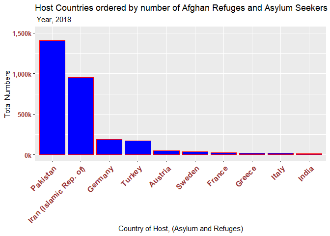
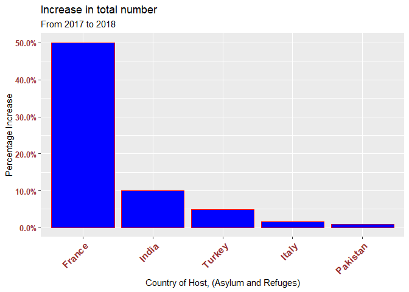
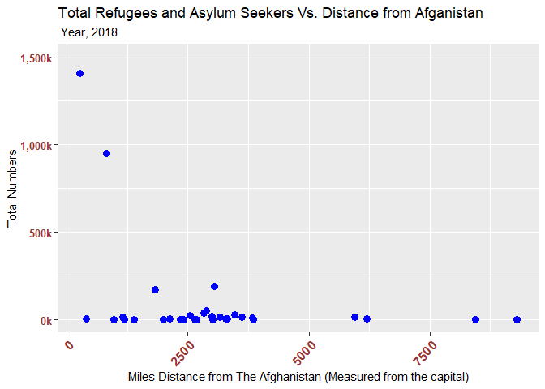
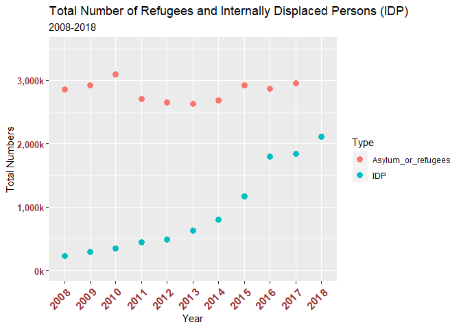
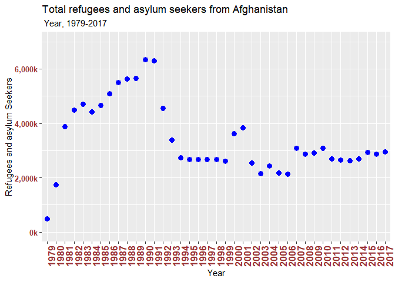

Which countries host the most Afghan refugees and asylum seekers? Create a plot of the Top 10 and a plot of the Top 5 countries with the biggest increase from 2017 to 2018. Where did you find the data and how did you decide to visualize it?
================================================================================================================================================================================================================================================

So, first to start our analysis here we import the required library in
the R programming language, the line with comments show the
*installation * if the package has not been installed in the R.

Initialization
--------------

Data Loading
------------

For answering the first three questions we use the one data-set, for the
last question we will use the another data-set (more complete form of
first data-set). So, here the data set was downloaded from the [UNHCR in
the following link:](http://popstats.unhcr.org/en/time_series).

\[<a href="http://popstats.unhcr.org/en/time_series" class="uri">http://popstats.unhcr.org/en/time_series</a>\]

At that link, we select the Years from 2008 until 2018 and as well
select the *Afghanistan* as the country of *Origin* and all other
countries as the *Host* countries. The following population types were
selected depending on the questions was asked:

-   Asylum-seekers
-   Internally displaced persons
-   Refugees (incl. refugee-like situations)

Note that the we skip the first three lines since there are comment for
the data and as well set that \* in the original data is showed as *NA*
after import the data.

    afghan_data <- read.csv('afghan_data.csv', header = T, skip = 3, na.strings = c('*'))
    head(afghan_data)

    ##   Year Country...territory.of.asylum.residence      Origin
    ## 1 2008                             Afghanistan Afghanistan
    ## 2 2008                               Australia Afghanistan
    ## 3 2008                               Australia Afghanistan
    ## 4 2008                                 Austria Afghanistan
    ## 5 2008                                 Austria Afghanistan
    ## 6 2008                              Azerbaijan Afghanistan
    ##                            Population.type  Value
    ## 1             Internally displaced persons 230670
    ## 2                           Asylum-seekers     28
    ## 3 Refugees (incl. refugee-like situations)   4933
    ## 4                           Asylum-seekers   2016
    ## 5 Refugees (incl. refugee-like situations)   5387
    ## 6                           Asylum-seekers     24

Brief Look on Column Names and Type
-----------------------------------

Here, let’s have look on column names and types:

    sapply(afghan_data, class)

    ##                                    Year Country...territory.of.asylum.residence 
    ##                               "integer"                                "factor" 
    ##                                  Origin                         Population.type 
    ##                                "factor"                                "factor" 
    ##                                   Value 
    ##                               "integer"

Data types seems fine, yet some of the column names could be changed to
the more convenient names:

    colnames(afghan_data) <- c('Year','Host','Origin','Type','Value')

The country with most Afghan Refugees and Asylum Seekers
--------------------------------------------------------

### Year 2017

So we start with the year 2017 and then 2018 which at the end both will
be used to show the increase from 2017 to 2018 in question number 3.
Here, first we *select* the year 2017 from the the data-set:

    data_refuge_2017 <- afghan_data %>%
      filter(Year == 2017)

Here, we make change that is since question asks about the *Refugees*
and *Asylum Seekers*, we rename the those both group one name, since we
want the *sum* of them per country of host(residence). (If the question
wanted to have separate analysis on Refugees and Asylum Seekers number,
then it need a little modified version of this code.)

    levels(data_refuge_2017$Type)

    ## [1] "Asylum-seekers"                          
    ## [2] "Internally displaced persons"            
    ## [3] "Refugees (incl. refugee-like situations)"

    data_refuge_2017_agg <- data_refuge_2017
    levels(data_refuge_2017_agg$Type) <- c('Asylum_or_refugees', 'IDP','Asylum_or_refugees')
    head(data_refuge_2017_agg)

    ##   Year                 Host      Origin               Type   Value
    ## 1 2017          Afghanistan Afghanistan                IDP 1837079
    ## 2 2017               Angola Afghanistan Asylum_or_refugees       1
    ## 3 2017              Albania Afghanistan Asylum_or_refugees       1
    ## 4 2017 United Arab Emirates Afghanistan Asylum_or_refugees      14
    ## 5 2017 United Arab Emirates Afghanistan Asylum_or_refugees       5
    ## 6 2017            Argentina Afghanistan Asylum_or_refugees       9

As we can see from the above, those two different group now are showed
in one single category *Asylum\_or\_refugees* . Also, we can see that
for this specific question, the first row indicating the *Internally
Displacement Persons* is not needed for the below analysis. Then, we
simply group the data based on *Host* and *Type* of population and sum
on them, order them finally, select the top 10.

    data_refuge_2017_agg_cor <- data_refuge_2017_agg[-1,]
    data_refugee_2017_agg_cor_order <- data_refuge_2017_agg_cor %>% 
      group_by(Host,Type) %>% 
      summarise(Frequency = sum(Value)) %>% 
      arrange(desc(Frequency)) %>%
      head(10)

Now, the data named *data\_refugee\_2017\_agg\_cor\_order* contains the
information for top countries in hosting afghan refugees and are ready
for visualize:

    ks <- function (x) { number_format(accuracy = 1,
                                       scale = 1/1000,
                                       suffix = "k",
                                       big.mark = ",")(x) }

    ggplot(data_refugee_2017_agg_cor_order, aes(reorder(Host, -Frequency), Frequency)) +
      geom_bar(stat = 'identity', fill='blue', color='red') +
      scale_y_continuous(labels = ks, limits = c(0, 1500000)) +
      labs(x= 'Country of Host, (Asylum and Refuges)') +
      labs(y = 'Total Number') +
      labs(title = 'Host Countries ordered by number of Afghan Refuges and Asylum Seekers') +
      labs(subtitle =' Year, 2017') +
      theme(axis.text.x = element_text(face = "bold", color = "#993333", 
                               size = 12, angle = 45, hjust = 1)) +
      theme(axis.text.y = element_text(face = "bold", color = "#993333", 
                               size = 10, hjust = 1)) 

The country with most Afghan Refugees and Asylum Seekers
--------------------------------------------------------

### Year 2018

Now, let’s repeat the above analysis for for the year 2018. It follows
exactly like the previous case with only difference here we select the
*Year* for 2018:

    data_refuge_2018 <- afghan_data %>%
      filter(Year == 2018)
    data_refuge_2018_agg <- data_refuge_2018
    levels(data_refuge_2018_agg$Type) <- c('Asylum_or_refugees', 'IDP','Asylum_or_refugees')
    data_refuge_2018_agg_cor <- data_refuge_2018_agg[-1,]

    data_refugee_2018_agg_cor_order <- data_refuge_2018_agg_cor %>% 
      group_by(Host,Type) %>% 
      summarise(Frequency = sum(Value)) %>% 
      arrange(desc(Frequency)) %>%
      head(10)

    ggplot(data_refugee_2018_agg_cor_order, aes(reorder(Host, -Frequency), Frequency)) +
      geom_bar(stat = 'identity', fill='blue', color='red') +
      scale_y_continuous(labels = ks, limits = c(0, 1500000)) +
      labs(x= 'Country of Host, (Asylum and Refuges)') +
      labs(y = 'Total Numbers') +
      labs(title = 'Host Countries ordered by number of Afghan Refuges and Asylum Seekers') +
      labs(subtitle =' Year, 2018') +
      theme(axis.text.x = element_text(face = "bold", color = "#993333", 
                               size = 12, angle = 45, hjust = 1)) +
      theme(axis.text.y = element_text(face = "bold", color = "#993333", 
                               size = 10, hjust = 1)) 

Top 5 countries with biggest increase from 2017 to 2018:
--------------------------------------------------------

Here, we do the *inner\_join* between the clean data of the year 2017
and 2018. Then, we add the new column named *Growth* which give the the
ratio of increase of the total Refuges and Asylum seekers from 2017 to
2018. At the end, we visualize the top 5 countries based on the growth.

Note: It must be mentioned here we calculate the *Percentage* increase
from the year 2017.

    data_refugee_2017_2018 <- left_join(data_refugee_2017_agg_cor_order, 
                                        data_refugee_2018_agg_cor_order, by='Host')

    data_refugee_2017_2018_growth <- data_refugee_2017_2018 %>% 
      `colnames<-`(c("Host", "Typex", "Number_2017",'Typey', 'Number_2018')) %>% 
      select(Host, Number_2017, Number_2018) %>% 
      mutate(Growth = (Number_2018-Number_2017)/Number_2017) %>% 
      arrange(desc(Growth)) %>% 
      head(5)

    ggplot(data_refugee_2017_2018_growth, aes(reorder(Host, -Growth), Growth)) +
      geom_bar(stat = 'identity', fill='blue', color='red') +
      labs(x= 'Country of Host, (Asylum and Refuges)') +
      labs(y = 'Percentage Increase') +
      labs(title = 'Increase in total number') +
      labs(subtitle ='From 2017 to 2018') +
      scale_y_continuous(labels = scales::percent) +
      theme(axis.text.x = element_text(face = "bold", color = "#993333", 
                               size = 12, angle = 45, hjust = 1)) +
      theme(axis.text.y = element_text(face = "bold", color = "#993333", 
                               size = 10, hjust = 1)) 

Is there a relationship between the number of Afghan refugees and asylum seekers in a country and the distance between that country and Afghanistan?
====================================================================================================================================================

Here, since we are looking for overall relationship between total number
of Refugees and Asylum Seekers, we first select the top 50 countries
hosting the the Afghans:

    data_refugee_2018_agg_cor_order_top50 <- data_refuge_2018_agg_cor %>% 
      group_by(Host,Type) %>% 
      summarise(Frequency = sum(Value)) %>% 
      arrange(desc(Frequency)) %>%
      head(50)

Then, for distance from Afghanistan to other countries, we do the web
scraping. We use the web
\[<a href="https://www.geodatos.net/en/distances/country/afghanistan" class="uri">https://www.geodatos.net/en/distances/country/afghanistan</a>\]
to find the distance between Afghanistan to at least 100 countries.

Web Scarping for Distance Between Countries
-------------------------------------------

    web <- read_html('https://www.geodatos.net/en/distances/country/afghanistan')
    Table <- web %>% 
      html_node('table') %>% 
      html_table(fill = T)

    head(Table)

    ##          Distance between countries Kilometers    Miles
    ## 1         From Afghanistan to China   3,310 km 2,057 mi
    ## 2         From Afghanistan to India   1,849 km 1,149 mi
    ## 3 From Afghanistan to United States  11,916 km 7,404 mi
    ## 4     From Afghanistan to Indonesia   6,163 km 3,830 mi
    ## 5        From Afghanistan to Brazil  13,585 km 8,441 mi
    ## 6      From Afghanistan to Pakistan     425 km   264 mi

However, we can see a few issues regarding this table. So, we clean this
table as the below: \* The first column must be just name of host
country \* The *mi* sign should be removed from the integer column \*
The country name *Iran* must be changed to as the name in the above data
(*Iran (Islamic Rep. of)*)

Then, after doing the above we can simply change the column names and
select the desired columns:

    Table$`Distance between countries` <-  gsub("From Afghanistan to "
                                                 , "", 
                                                 as.character(Table$`Distance between countries`))
    Table$Miles <-  gsub( " mi", "", as.character(Table$Miles))
    Table$Miles <-  gsub( ",", "", as.character(Table$Miles))
    Table$Miles <- as.integer(Table$Miles)
    Table[18,1] <- 'Iran (Islamic Rep. of)'
    colnames(Table) <- c("Host", "XX", "Miles")
    Distance_host_miles <- Table %>%
      select(Host, Miles)

    head(Distance_host_miles)

    ##            Host Miles
    ## 1         China  2057
    ## 2         India  1149
    ## 3 United States  7404
    ## 4     Indonesia  3830
    ## 5        Brazil  8441
    ## 6      Pakistan   264

Inner\_join the Number of Refugees and Asylum with the Distance Table
---------------------------------------------------------------------

Here, we do the inner join the two tables with the common column name
*Host* and could have look on the data:

Note: Here because of the limitation in the data bank of the website we
used, it was only to find the distance for 33 countries, which could be
sufficiently enough to make initial argument about the correlation:

    refugee_dis_2018 <- inner_join(data_refugee_2018_agg_cor_order_top50,Distance_host_miles
                                   , by= 'Host')

    ## Warning: Column `Host` joining factor and character vector, coercing into
    ## character vector

    head(refugee_dis_2018)

    ## # A tibble: 6 x 4
    ## # Groups:   Host [6]
    ##   Host                   Type               Frequency Miles
    ##   <chr>                  <fct>                  <int> <int>
    ## 1 Pakistan               Asylum_or_refugees   1408533   264
    ## 2 Iran (Islamic Rep. of) Asylum_or_refugees    951142   816
    ## 3 Germany                Asylum_or_refugees    191856  3053
    ## 4 Turkey                 Asylum_or_refugees    171519  1825
    ## 5 Austria                Asylum_or_refugees     49196  2871
    ## 6 Sweden                 Asylum_or_refugees     36818  2828

    ggplot(refugee_dis_2018, aes(Miles, Frequency)) +
      geom_point(size=3, color='blue') +
      scale_y_continuous(labels = ks, limits = c(0, 1500000)) +
      labs(x= 'Miles Distance from The Afghanistan (Measured from the capital)') +
      labs(y = 'Total Numbers') +
      labs(title = 'Total Refugees and Asylum Seekers Vs. Distance from Afganistan') +
      labs(subtitle =' Year, 2018') +
      theme(axis.text.x = element_text(face = "bold", color = "#993333", 
                               size = 12, angle = 45, hjust = 1)) +
      theme(axis.text.y = element_text(face = "bold", color = "#993333", 
                               size = 10, hjust = 1)) 

Looking on the above plot, we can argue that there is no meaningful
correlation between distance from Afghanistan and total number of the
refugees and asylum seekers from Afghanistan. Especially, looking on the
close distance from Afghanistan, the neighborhood countries of the
Afghanistan have different number of Afghans while having similar
distance from the Afghanistan.

Visualize for the last 10 years: total number of refugees and asylum seekers from Afghanistan together with the number of internally displaced from Afghanistan.
================================================================================================================================================================

Here, referring to the first data set, we can compute the total numbers
as well we have the number of internally displaced persons in
Afghanistan on every years. Then, we plot both two trends in one column.

Note: The data of refuges and Asylum seekers for year 2018 is not
complete, therefore it is not showed for the year 2018 in the below
plot.

    tot_ref_idp <-afghan_data
    levels(tot_ref_idp$Type) <- c('Asylum_or_refugees', 'IDP','Asylum_or_refugees')
    tot_ref_idp$Year <- as.factor(tot_ref_idp$Year)
    tot_ref_idp$Type <- as.factor(tot_ref_idp$Type)

    tot_ref_idp_sum <- tot_ref_idp %>% 
      group_by(Year, Type) %>% 
      summarise(Total = sum(Value))  

    ggplot(tot_ref_idp_sum, aes(Year,Total)) +
      geom_point(aes(colour = Type), size = 3) +
      scale_y_continuous(labels = ks, limits = c(0, 3500000)) +
      labs(x= 'Year') +
      labs(y = 'Total Numbers') +
      labs(title = 'Total Number of Refugees and Internally Displaced Persons (IDP)') +
      labs(subtitle ='2008-2018 ') +
      theme(axis.text.x = element_text(face = "bold", color = "#993333", 
                               size = 12, angle = 45, hjust = 1)) +
      theme(axis.text.y = element_text(face = "bold", color = "#993333", 
                               size = 10, hjust = 1)) 

    ## Warning: Removed 1 rows containing missing values (geom_point).

If you were to design a model for forecasting next year’s refugees and asylum seekers from Afghanistan, what type of model would you want to try and what kind of input do you think is needed for it to work? (NB: You do not need to actually build the model.)
=================================================================================================================================================================================================================================================================

Look on The Data (Longer Span)
------------------------------

Here, we have look on the total number of refugees and asylum seekers in
the longer perspective. To do so, we now look on the data of from
earlier possible date available in UNHRC (from 1979) and visualize the
data to get the sense of the trend of the:

    all_years <-read.csv('all_year_data.csv', header = T, skip = 3, na.strings = c('*'))
    colnames(all_years) <- c('Year','Host','Origin','Type','Value')

    levels(all_years$Type) <- c('Asylum_or_refugees', 'IDP','Asylum_or_refugees')

    all_year_sum <- all_years %>% 
      group_by(Year, Type) %>% 
      summarise(Total = sum(Value)) %>%  
      filter(Type=='Asylum_or_refugees')

    all_year_sum$Year <- as.factor(all_year_sum$Year)

    all_year_sum <- all_year_sum[-40,]
    ggplot(all_year_sum, aes(Year,Total)) +
      geom_point(size = 3, fill='red', color='blue') +
      scale_y_continuous(labels = ks, limits = c(0, 7000000)) +
      labs(x= 'Year') +
      labs(y = 'Refugees and asylum Seekers') +
      labs(title = 'Total refugees and asylum seekers from Afghanistan') +
      labs(subtitle =' Year, 1979-2017') +
      theme(axis.text.x = element_text(face = "bold", color = "#993333", 
                               size = 12, angle = 90, hjust = 1)) +
      theme(axis.text.y = element_text(face = "bold", color = "#993333", 
                               size = 10, hjust = 1)) 

Comments for Model Building
---------------------------

To do the forecasting, for the period after the 1990 we could try the
time sery model. Looking on the data possibly the ARMA model are the
good choice for the forecasting. On the other hand, deep learning model
like the Recurrent Neural Network as well could be tested. On the other
hand, we can figure out that there are some spikes in the around 1990
and 2002 in total number of the refugees and asylum seekers. These two
spikes could b attributed to the some internal changes, for example in
this case wars inside the Afghanistan. Therefore, information like the
is there conflict zone insides the country or economy level as well
could help to make a better model for this data set.
