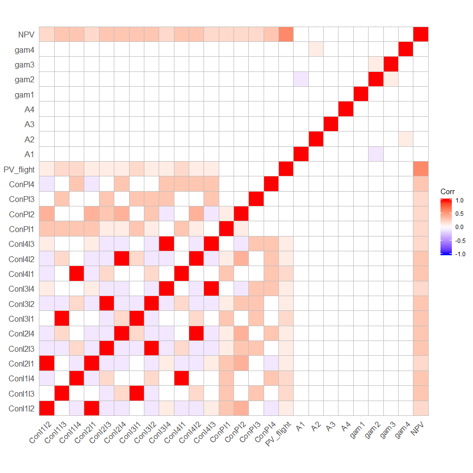
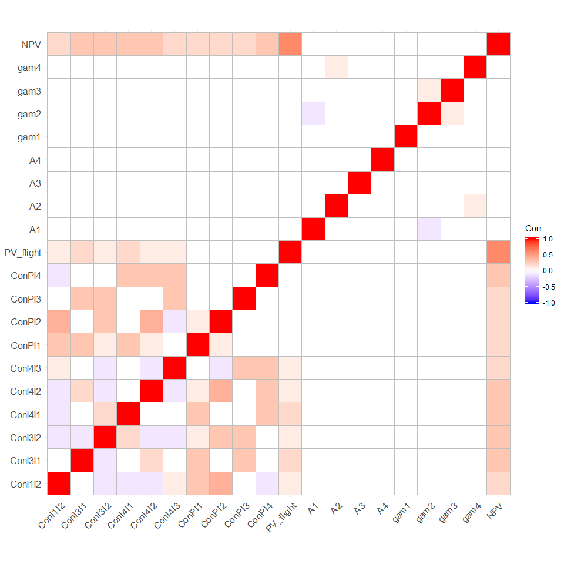
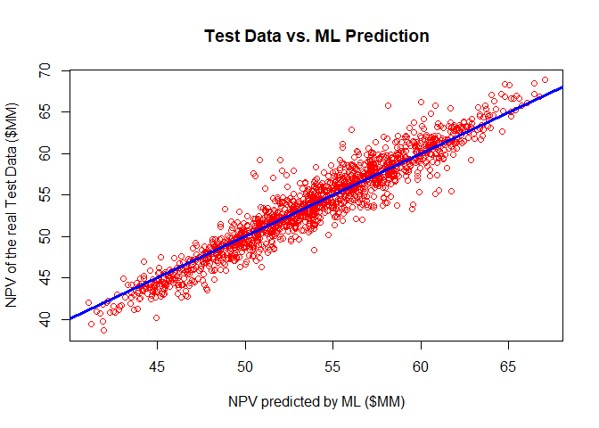

    library(tidyverse)
    library(ggplot2)
    library(ggcorrplot)
    library("GGally")
    library(caret)
    library(doSNOW)

Import the Data
===============

    data <- read.csv('train_allreal_names.csv')
    head(data)

    ##   X  ConI1I2  ConI1I3  ConI1I4  ConI2I1  ConI2I3  ConI2I4  ConI3I1  ConI3I2
    ## 1 1 1.197009 1.794732 2.397519 1.136494 1.811036 1.178921 1.769486 1.798020
    ## 2 2 1.370751 1.609703 2.603256 1.369754 1.848122 1.364106 1.545308 1.778901
    ## 3 3 1.197805 1.974518 2.690941 1.275293 1.819897 1.247667 1.968648 1.810238
    ## 4 4 1.216054 1.815047 2.684506 1.218889 1.763886 1.281996 1.889774 1.810357
    ## 5 5 1.104374 1.688002 2.573770 1.112539 1.773235 1.375900 1.771935 1.804519
    ## 6 6 1.063912 1.979038 2.538925 1.116667 1.859795 1.186824 2.048105 1.853593
    ##     ConI3I4  ConI4I1  ConI4I2   ConI4I3    ConPI1    ConPI2    ConPI3    ConPI4
    ## 1 0.4180600 2.477331 1.179474 0.4583601 0.6774903 0.3192029 0.6450933 0.5529229
    ## 2 0.4235951 2.530953 1.275130 0.4156282 0.7440811 0.3318827 0.5679226 0.6125266
    ## 3 0.4729509 2.692909 1.223844 0.4231628 0.7891240 0.3660942 0.6038898 0.5804768
    ## 4 0.4962542 2.732164 1.347532 0.4472813 0.8146611 0.2968731 0.6144062 0.5837607
    ## 5 0.4730142 2.593494 1.298356 0.5127484 0.7111817 0.3235421 0.6059673 0.7048939
    ## 6 0.4864869 2.561240 1.188823 0.4351454 0.7337789 0.3306681 0.6428683 0.5968821
    ##   PV_flight  A1  A2  A3  A4    gam1     gam2    gam3    gam4   NPV
    ## 1  87.55556 150 150 100 300 0.00025 -0.00025 0.00100 0.00100 56.68
    ## 2  91.75309 250 150 300 250 0.00150  0.00100 0.00025 0.00100 56.29
    ## 3  89.03704 300 150 200 100 0.00125  0.00100 0.00100 0.00175 57.09
    ## 4  84.34568 150 100 300 150 0.00000 -0.00050 0.00075 0.00150 56.93
    ## 5  86.51852 150 250 200 100 0.00200  0.00050 0.00025 0.00125 56.61
    ## 6  88.93827 200 200 300 100 0.00050  0.00175 0.00075 0.00175 57.36

    data <- data[,-c(1)]
    head(data)

    ##    ConI1I2  ConI1I3  ConI1I4  ConI2I1  ConI2I3  ConI2I4  ConI3I1  ConI3I2
    ## 1 1.197009 1.794732 2.397519 1.136494 1.811036 1.178921 1.769486 1.798020
    ## 2 1.370751 1.609703 2.603256 1.369754 1.848122 1.364106 1.545308 1.778901
    ## 3 1.197805 1.974518 2.690941 1.275293 1.819897 1.247667 1.968648 1.810238
    ## 4 1.216054 1.815047 2.684506 1.218889 1.763886 1.281996 1.889774 1.810357
    ## 5 1.104374 1.688002 2.573770 1.112539 1.773235 1.375900 1.771935 1.804519
    ## 6 1.063912 1.979038 2.538925 1.116667 1.859795 1.186824 2.048105 1.853593
    ##     ConI3I4  ConI4I1  ConI4I2   ConI4I3    ConPI1    ConPI2    ConPI3    ConPI4
    ## 1 0.4180600 2.477331 1.179474 0.4583601 0.6774903 0.3192029 0.6450933 0.5529229
    ## 2 0.4235951 2.530953 1.275130 0.4156282 0.7440811 0.3318827 0.5679226 0.6125266
    ## 3 0.4729509 2.692909 1.223844 0.4231628 0.7891240 0.3660942 0.6038898 0.5804768
    ## 4 0.4962542 2.732164 1.347532 0.4472813 0.8146611 0.2968731 0.6144062 0.5837607
    ## 5 0.4730142 2.593494 1.298356 0.5127484 0.7111817 0.3235421 0.6059673 0.7048939
    ## 6 0.4864869 2.561240 1.188823 0.4351454 0.7337789 0.3306681 0.6428683 0.5968821
    ##   PV_flight  A1  A2  A3  A4    gam1     gam2    gam3    gam4   NPV
    ## 1  87.55556 150 150 100 300 0.00025 -0.00025 0.00100 0.00100 56.68
    ## 2  91.75309 250 150 300 250 0.00150  0.00100 0.00025 0.00100 56.29
    ## 3  89.03704 300 150 200 100 0.00125  0.00100 0.00100 0.00175 57.09
    ## 4  84.34568 150 100 300 150 0.00000 -0.00050 0.00075 0.00150 56.93
    ## 5  86.51852 150 250 200 100 0.00200  0.00050 0.00025 0.00125 56.61
    ## 6  88.93827 200 200 300 100 0.00050  0.00175 0.00075 0.00175 57.36

    corr <- round(cor(data), 1)
    ggcorrplot(corr)

    cor_col <- cor(data)
    hc <- findCorrelation(cor_col,cutoff = 0.85)
    hc_sort <- sort(hc)
    data_reduced <- data[,-c(hc_sort)]

    corr_reduced <- round(cor(data_reduced), 1)
    ggcorrplot(corr_reduced)

    set.seed(54321)

    indexes <- createDataPartition(data_reduced$NPV,
                                   times = 1,
                                   p = 0.7,
                                   list = FALSE)
    data_train <- data_reduced[indexes,]
    data_test <- data_reduced[-indexes,]

    head(data_train)

    ##    ConI1I2  ConI3I1  ConI3I2  ConI4I1  ConI4I2   ConI4I3    ConPI1    ConPI2
    ## 1 1.197009 1.769486 1.798020 2.477331 1.179474 0.4583601 0.6774903 0.3192029
    ## 2 1.370751 1.545308 1.778901 2.530953 1.275130 0.4156282 0.7440811 0.3318827
    ## 3 1.197805 1.968648 1.810238 2.692909 1.223844 0.4231628 0.7891240 0.3660942
    ## 4 1.216054 1.889774 1.810357 2.732164 1.347532 0.4472813 0.8146611 0.2968731
    ## 5 1.104374 1.771935 1.804519 2.593494 1.298356 0.5127484 0.7111817 0.3235421
    ## 6 1.063912 2.048105 1.853593 2.561240 1.188823 0.4351454 0.7337789 0.3306681
    ##      ConPI3    ConPI4 PV_flight  A1  A2  A3  A4    gam1     gam2    gam3
    ## 1 0.6450933 0.5529229  87.55556 150 150 100 300 0.00025 -0.00025 0.00100
    ## 2 0.5679226 0.6125266  91.75309 250 150 300 250 0.00150  0.00100 0.00025
    ## 3 0.6038898 0.5804768  89.03704 300 150 200 100 0.00125  0.00100 0.00100
    ## 4 0.6144062 0.5837607  84.34568 150 100 300 150 0.00000 -0.00050 0.00075
    ## 5 0.6059673 0.7048939  86.51852 150 250 200 100 0.00200  0.00050 0.00025
    ## 6 0.6428683 0.5968821  88.93827 200 200 300 100 0.00050  0.00175 0.00075
    ##      gam4   NPV
    ## 1 0.00100 56.68
    ## 2 0.00100 56.29
    ## 3 0.00175 57.09
    ## 4 0.00150 56.93
    ## 5 0.00125 56.61
    ## 6 0.00175 57.36

    #=================================================================
    # Train Model
    #=================================================================
    # nrounds max_depth  eta gamma colsample_bytree min_child_weight subsample
    #4    4000         6 0.01     0              0.4                2         1
    #   nrounds max_depth   eta gamma colsample_bytree min_child_weight subsample
    #10    4000         6 0.025     0              0.4             2.25         1
    # Set up caret to perform 10-fold cross validation repeated 3 
    # times and to use a grid search for optimal model hyperparamter
    # values.
    train.control <- trainControl(method = "repeatedcv",
                                  number = 5,
                                  repeats = 3,
                                  search = "grid")

    # Leverage a grid search of hyperparameters for xgboost. See 
    # the following presentation for more information:
    # https://www.slideshare.net/odsc/owen-zhangopen-sourcetoolsanddscompetitions1
    tune.grid <- expand.grid(eta = c(0.05,0.1),
                             nrounds = c(1000,4000),
                             max_depth = c(6,8),
                             min_child_weight = c(1.5,2.25,3),
                             colsample_bytree = c(0.4),
                             gamma = 0,
                             subsample = 1)

    # Use the doSNOW package to enable caret to train in parallel.
    # While there are many package options in this space, doSNOW
    # has the advantage of working on both Windows and Mac OS X.
    #
    # Create a socket cluster using 10 processes. 
    #
    # NOTE - Tune this number based on the number of cores/threads 
    # available on your machine!!!
    #
    cl <- makeCluster(8, type = "SOCK")

    # Register cluster so that caret will know to train in parallel.
    registerDoSNOW(cl)

    caret.cv <- train(NPV ~ ., 
                      data = data_train,
                      method = "xgbTree",
                      tuneGrid = tune.grid,
                      trControl = train.control)

    stopCluster(cl)

    xgboost_model <- readRDS("modelxgboost.rds")

    pred1s <- predict(xgboost_model, data_test)

    ## [19:49:33] WARNING: amalgamation/../src/objective/regression_obj.cu:152: reg:linear is now deprecated in favor of reg:squarederror.

    plot(pred1s,data_test$NPV,col='red',type = 'p',pch=1 ,xlab = 'NPV predicted by ML ($MM)',ylab = 'NPV of the real Test Data ($MM)',main = 'Test Data vs. ML Prediction')
    abline(a=0,b=1,col=4,lwd=3)  
    r2 <- caret::R2(pred1s,data_test$NPV)
    mylabel = bquote(italic(R)^2 == .(format(r2, digits = 2)))
    text(1,1, labels = mylabel, pos = 1)

